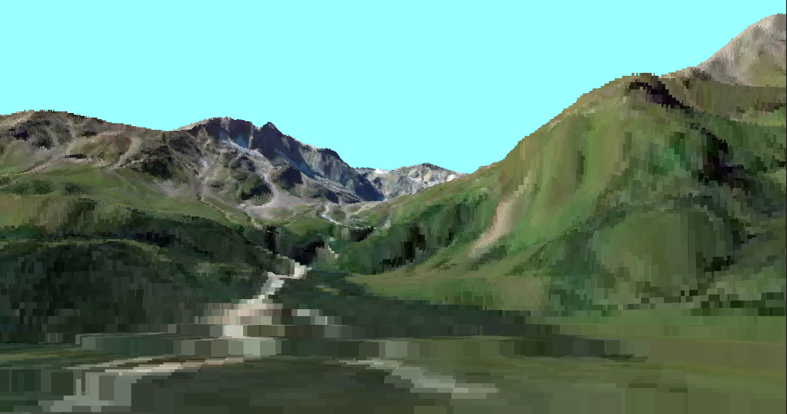

# VoxelSpace

A VoxelSpace renderer written in golang

Features:
- [x] Camera Controls (Now With Mice)
- [x] Height and Color map loading
- [x] Multi-threading
- [x] Gravity
- [ ] Sprite Rendering

